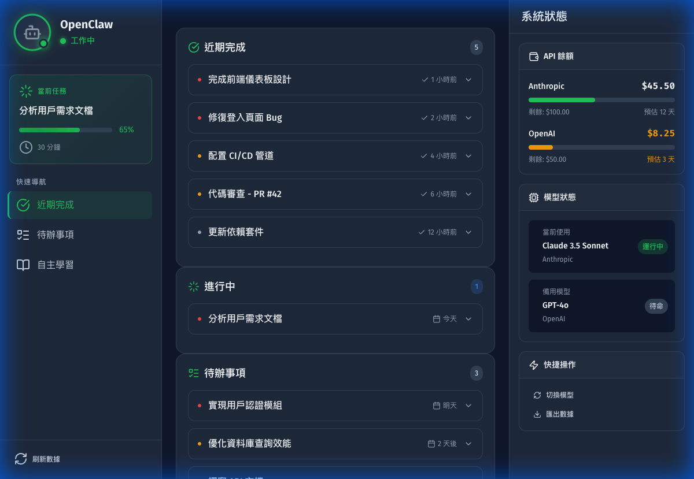

# OpenClaw Dashboard

專為 OpenClaw AI Agent 設計的監控儀表板，支援即時狀態追蹤、任務管理和 API 監控。



## ✨ 功能特點

### 左側邊欄
- 🤖 Agent 頭像與名稱顯示
- 💚 狀態指示燈（工作中有心跳動畫 / 閒置）
- 📋 當前任務摘要與進度

### 中央主區塊
- ✅ **近期完成** - 最近完成的 5-10 項任務
- 📝 **待辦事項** - 優先級排序的任務清單
- 📚 **自主學習** - 標記想研究/改善的項目

### 右側資訊欄
- 💰 **API 餘額監控** - 顯示剩餘額度與預估可用天數
- 🔧 **模型狀態** - 當前使用模型與備用模型狀態

### 互動功能
- 🔍 點擊任務展開詳情
- ⭐ 學習項目優先級標記
- ⚠️ 餘額警告自動通知

## 🚀 快速開始

### 本地開發

1. 克隆專案
```bash
git clone https://github.com/your-username/claw_dashboard.git
cd claw_dashboard
```

2. 啟動本地伺服器
```bash
# 使用 Python
python3 -m http.server 8080

# 或使用 Node.js
npx serve .
```

3. 開啟瀏覽器訪問 `http://localhost:8080`

### 部署到 GitHub Pages

1. 在 GitHub 上建立 repository
2. 推送程式碼
```bash
git add .
git commit -m "Initial commit"
git push origin main
```
3. 在 Repository Settings → Pages 中啟用 GitHub Pages
4. 選擇 `main` 分支作為來源

## 🔌 API 接口整合

Dashboard 採用模塊化設計，所有 API 調用都通過 `js/api/ApiClient.js` 進行。

### 切換到真實 API

編輯 `js/api/ApiClient.js`：

```javascript
const API_CONFIG = {
    useMockData: false,  // 改為 false
    baseUrl: 'https://your-api-endpoint.com',
    timeout: 10000,
    refreshInterval: 30000
};
```

### 接口規範

#### Agent 狀態
```typescript
interface AgentStatus {
    name: string;
    avatar: string | null;
    status: 'working' | 'idle';
    currentTask?: {
        id: string;
        title: string;
        progress: number;  // 0-100
        startedAt: string; // ISO 時間
    };
}
```

#### 任務
```typescript
interface Task {
    id: string;
    title: string;
    description: string;
    status: 'completed' | 'pending' | 'in-progress';
    priority: 'high' | 'medium' | 'low';
    completedAt?: string;
    dueDate?: string;
    tags: string[];
}
```

#### API 餘額
```typescript
interface APIBalance {
    provider: string;
    remaining: number;
    total: number;
    estimatedDaysLeft: number;
    lastUpdated: string;
}
```

#### 模型資訊
```typescript
interface ModelInfo {
    current: {
        id: string;
        name: string;
        provider: string;
        status: 'active' | 'rate-limited' | 'error';
    };
    fallback: {
        id: string;
        name: string;
        provider: string;
        status: 'ready' | 'unavailable';
    };
}
```

#### 學習項目
```typescript
interface LearningItem {
    id: string;
    title: string;
    description: string;
    priority: 1 | 2 | 3 | 4 | 5;
    category: string;
    addedAt: string;
    status: 'researching' | 'planned' | 'completed';
}
```

## 🧩 模塊化架構

### 核心系統

| 模塊 | 檔案 | 功能 |
|------|------|------|
| EventBus | `js/core/EventBus.js` | 事件發布/訂閱系統 |
| ModuleRegistry | `js/core/ModuleRegistry.js` | 模塊註冊與生命週期管理 |
| StateManager | `js/core/StateManager.js` | 集中式狀態管理 |

### 新增模塊

1. 在 `js/modules/` 創建新模塊：

```javascript
// js/modules/MyNewModule.js
import EventBus from '../core/EventBus.js';
import StateManager from '../core/StateManager.js';

class MyNewModule {
    constructor(config) {
        this.config = config;
    }

    async init() {
        // 初始化邏輯
    }

    render() {
        return `<div class="my-module">內容</div>`;
    }

    afterRender() {
        // DOM 操作
    }

    destroy() {
        // 清理
    }
}

export default MyNewModule;
```

2. 在 `js/main.js` 註冊模塊：

```javascript
import MyNewModule from './modules/MyNewModule.js';

ModuleRegistry.register('myModule', MyNewModule, {
    name: '我的模塊',
    container: '#my-module-container',
    priority: 25
});
```

3. 在 HTML 中添加容器：

```html
<div id="my-module-container"></div>
```

## 📁 專案結構

```
claw_dashboard/
├── index.html              # 主頁面
├── .nojekyll               # GitHub Pages 配置
├── styles/
│   ├── variables.css       # CSS 變數 (設計令牌)
│   ├── base.css            # 基礎樣式
│   ├── components.css      # 組件樣式
│   ├── animations.css      # 動畫效果
│   ├── layout.css          # 佈局樣式
│   └── modules.css         # 模塊專用樣式
└── js/
    ├── main.js             # 主程式入口
    ├── core/
    │   ├── EventBus.js     # 事件系統
    │   ├── ModuleRegistry.js # 模塊管理
    │   └── StateManager.js # 狀態管理
    ├── api/
    │   ├── ApiClient.js    # API 接口層
    │   └── MockDataProvider.js # 模擬數據
    └── modules/
        ├── SidebarModule.js
        ├── TasksModule.js
        ├── LearningModule.js
        ├── InfoPanelModule.js
        └── NotificationModule.js
```

## 🎨 自訂主題

編輯 `styles/variables.css` 中的 CSS 變數：

```css
:root {
    --color-primary: #1E293B;
    --color-cta: #22C55E;
    --color-background: #0F172A;
    /* ... */
}
```

## 🔧 開發調試

在瀏覽器開發者工具中可使用：

```javascript
// 查看狀態
StateManager.getState()

// 手動觸發刷新
ApiClient.refreshAll()

// 發送測試通知
EventBus.emit('notification:show', {
    type: 'success',
    message: '測試通知'
})

// 查看已註冊模塊
ModuleRegistry.list()
```

## 📄 授權

MIT License
